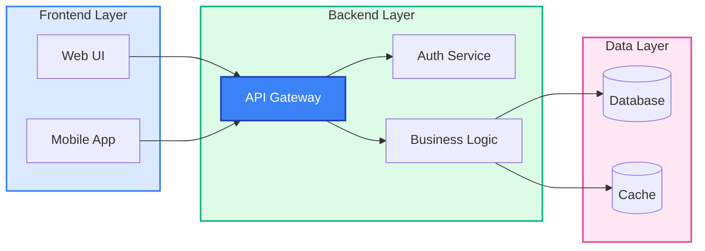
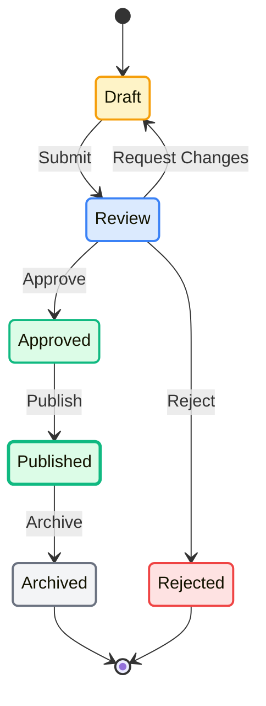
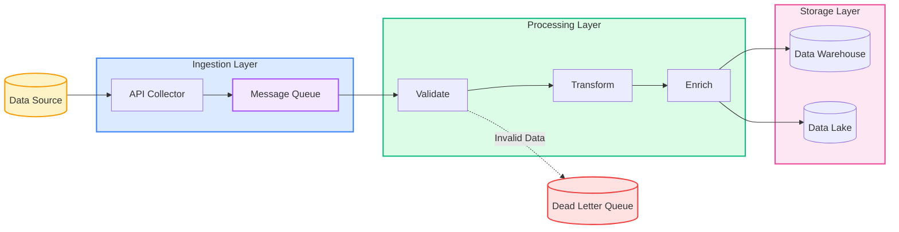
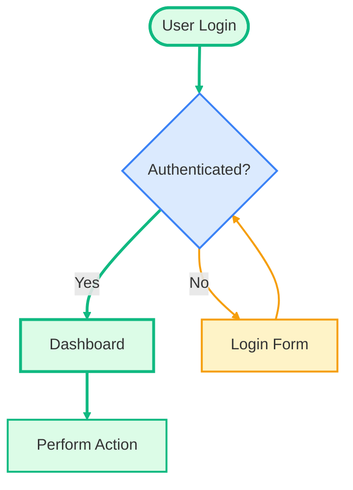
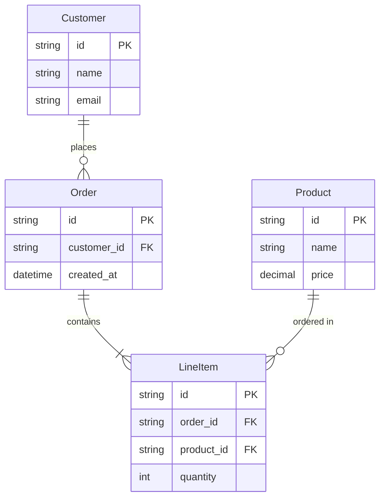

# Mermaid Diagram Pattern Examples

This file contains detailed examples of common Mermaid diagram patterns referenced from the main skill.

## Contents

- [Pattern 1: Three-Tier Architecture](#pattern-1-three-tier-architecture)
- [Pattern 2: Request Flow with Error Handling](#pattern-2-request-flow-with-error-handling)
- [Pattern 3: State Machine with Semantic Colors](#pattern-3-state-machine-with-semantic-colors)
- [Pattern 4: Data Flow Pipeline](#pattern-4-data-flow-pipeline)
- [Advanced Technique: Highlighting Critical Paths](#advanced-technique-highlighting-critical-paths)
- [Using Icons and Emojis](#using-icons-and-emojis)
- [Entity Relationship Diagram](#entity-relationship-diagram)

## Pattern 1: Three-Tier Architecture

**Why this works:**

- Clear visual separation of layers with color
- Semantic colors (blue=frontend, green=backend, pink=data)
- Key component (API Gateway) highlighted with darker fill
- Clean left-to-right flow

## Pattern 2: Request Flow with Error Handling

```mermaid
sequenceDiagram
    participant User
    participant API
    participant Auth
    participant DB

    User->>+API: POST /order
    API->>+Auth: Validate Token

    alt Valid Token
        Auth-->>-API: ✓ Valid
        API->>+DB: Create Order
        DB-->>-API: Order ID
        API-->>-User: 201 Created
    else Invalid Token
        Auth-->>API: ✗ Invalid
        API-->>User: 401 Unauthorized
    end

    Note over User,DB: Error responses return immediately
```

**Why this works:**

- Shows both success and error paths
- Uses alt block for clear branching
- Includes status codes for clarity
- Note provides additional context
- Clean, uncluttered layout

## Pattern 3: State Machine with Semantic Colors

**Why this works:**

- Colors indicate state semantics (yellow=draft, blue=in-process, green=success, red=terminal-negative)
- Published state has thicker border (current/most common state)
- Clear state transition labels
- Both success and failure paths shown

## Pattern 4: Data Flow Pipeline

**Why this works:**

- Pipeline flow is left-to-right (natural reading)
- Layers clearly separated by color
- Error path (dead letter queue) shown with dotted line and red
- Queue highlighted differently (purple) to show async boundary
- Database symbols for storage components

## Advanced Technique: Highlighting Critical Paths

**Technique**: Main path uses green with thick strokes, alternate path uses amber with normal width.

## Using Icons and Emojis

```mermaid
flowchart LR
    user["👤 User"]
    web["🌐 Web App"]
    api["⚙️ API"]
    db[("💾 Database")]
    cache[("⚡ Cache")]

    user --> web
    web --> api
    api --> db
    api --> cache

    style user fill:#dbeafe,stroke:#3b82f6
    style web fill:#dbeafe,stroke:#3b82f6
    style api fill:#dcfce7,stroke:#10b981
    style db fill:#fce7f3,stroke:#ec4899
    style cache fill:#fef3c7,stroke:#f59e0b
```

**Use sparingly**: Icons can help but too many become noisy. Best for user types, external systems, and storage.

## Entity Relationship Diagram

**ERD-specific tips:**

- Always show cardinality (one-to-many, many-to-many)
- Include primary keys (PK) and foreign keys (FK)
- Keep to essential fields - full schema belongs in docs
- Use relationship labels that read naturally
