# Mermaid Syntax Reference

Quick reference for generating valid Mermaid diagram code.

## Flowchart

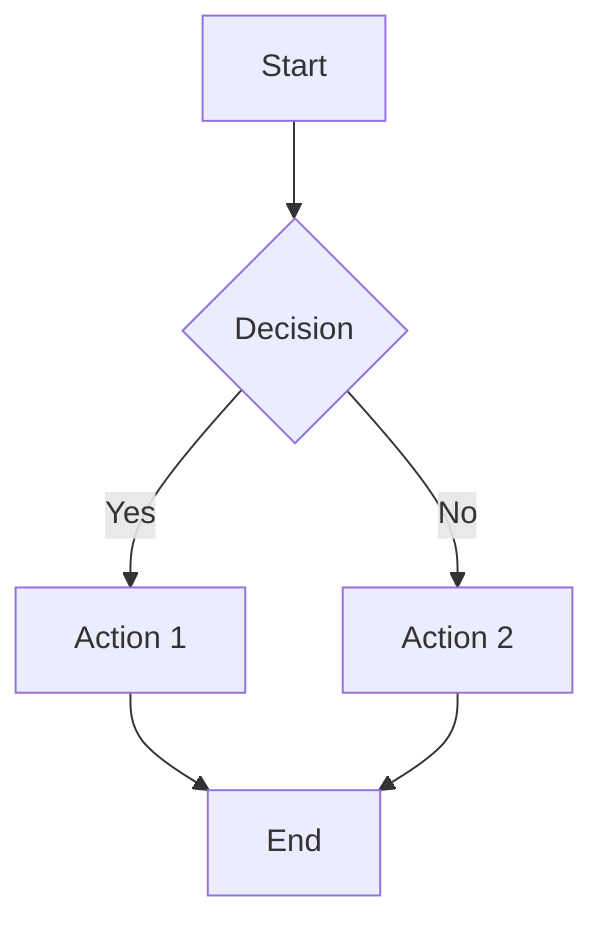

### Direction
- `TD` / `TB` - Top to bottom
- `BT` - Bottom to top
- `LR` - Left to right
- `RL` - Right to left

### Node Shapes
- `A[Text]` - Rectangle
- `A(Text)` - Rounded rectangle
- `A([Text])` - Stadium/pill
- `A[[Text]]` - Subroutine
- `A[(Text)]` - Cylinder (database)
- `A((Text))` - Circle
- `A>Text]` - Asymmetric
- `A{Text}` - Diamond (decision)
- `A{{Text}}` - Hexagon
- `A[/Text/]` - Parallelogram
- `A[\Text\]` - Parallelogram alt
- `A[/Text\]` - Trapezoid
- `A[\Text/]` - Trapezoid alt

### Edge Styles
- `A --> B` - Arrow
- `A --- B` - Line
- `A -.-> B` - Dotted arrow
- `A ==> B` - Thick arrow
- `A -->|text| B` - Arrow with label (preferred)
- `A ---|text| B` - Line with label (preferred)

**Important**: Always use pipe syntax `-->|label|` for edge labels. The space-dash syntax `-- label -->` can cause incomplete renders.

### Subgraphs
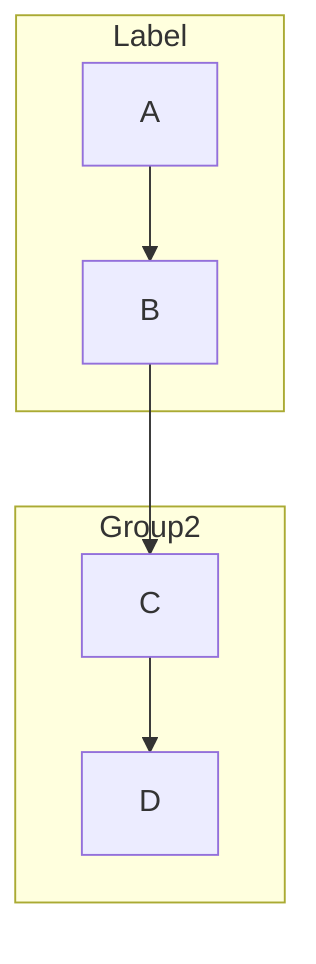

## Sequence Diagram

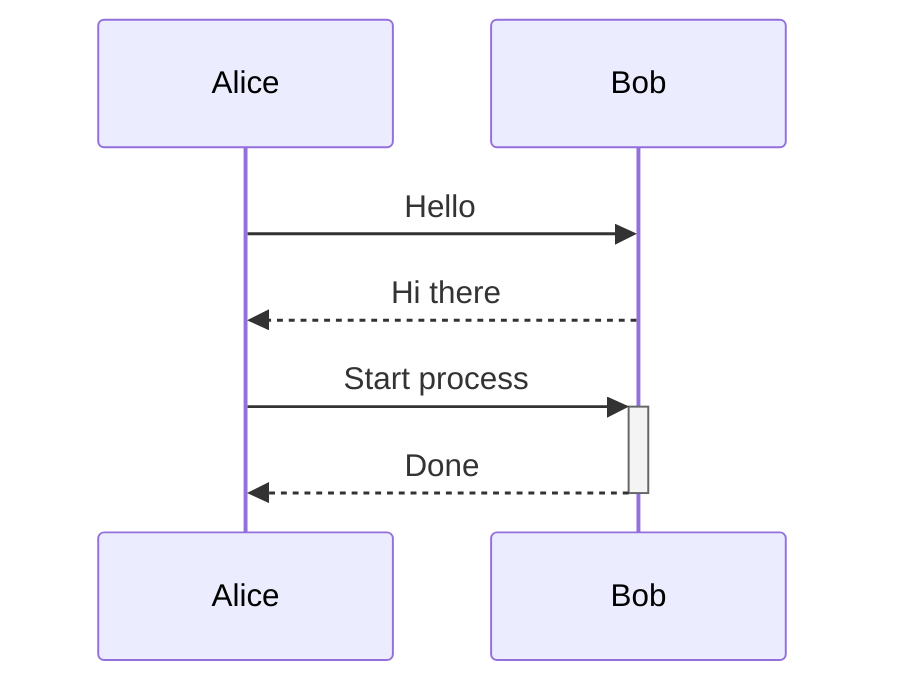

### Arrow Types
- `->>` - Solid arrow
- `-->>` - Dashed arrow
- `-x` - Solid with x
- `--x` - Dashed with x
- `-)` - Solid open arrow
- `--)` - Dashed open arrow

### Activations
- `+` after arrow activates participant
- `-` after arrow deactivates participant

### Notes and Boxes
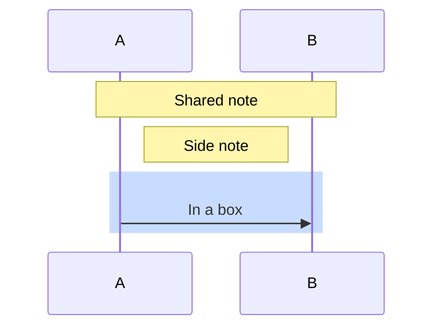

### Loops and Conditionals
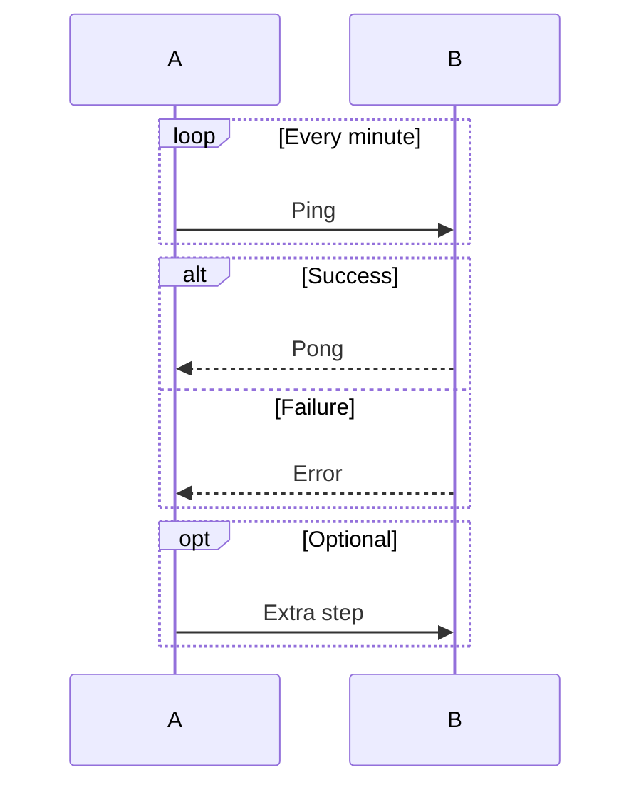

## State Diagram

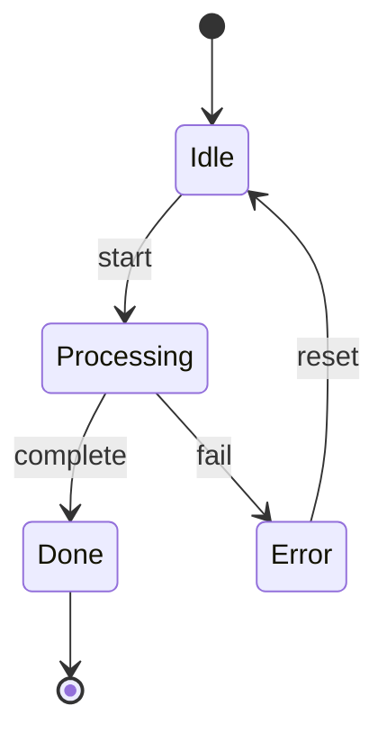

### Composite States
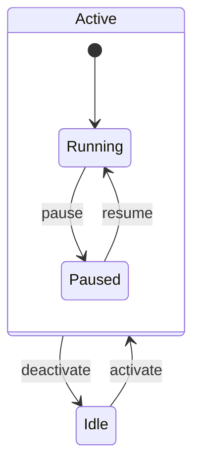

### Notes
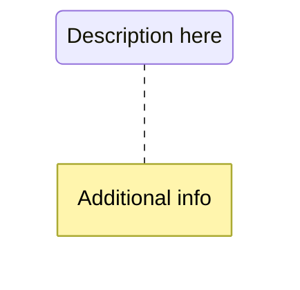

## Class Diagram

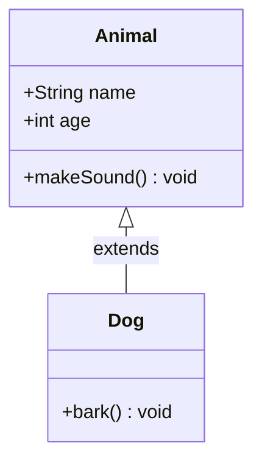

### Relationships
- `<|--` - Inheritance
- `*--` - Composition
- `o--` - Aggregation
- `-->` - Association
- `--` - Link (solid)
- `..>` - Dependency
- `..|>` - Realisation
- `..` - Link (dashed)

### Cardinality
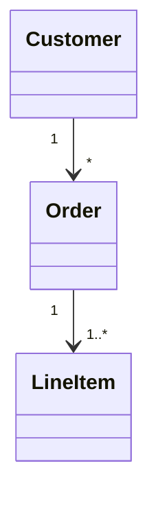

### Visibility
- `+` Public
- `-` Private
- `#` Protected
- `~` Package/Internal

## Entity-Relationship Diagram

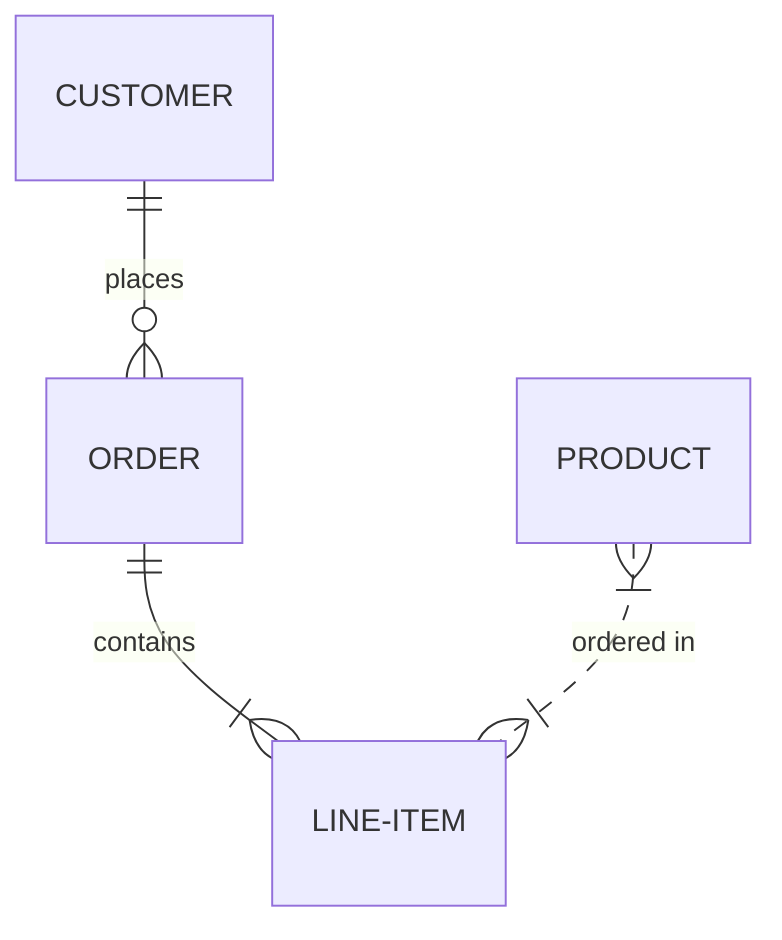

### Relationship Types
- `||` - Exactly one
- `|{` - One or more
- `o{` - Zero or more
- `o|` - Zero or one

### Identifying vs Non-identifying
- `--` - Identifying (solid)
- `..` - Non-identifying (dashed)

### Attributes
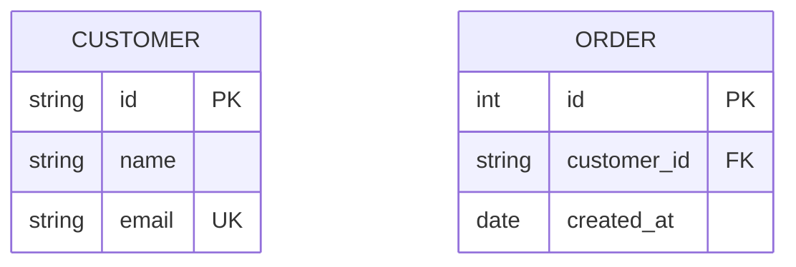

## Styling

### CSS Classes
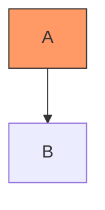

### Inline Styles
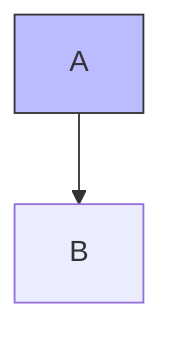

## Tips

1. **Escape special characters**: Use quotes for labels with special chars: `A["Label with (parens)"]`
2. **Multi-line labels**: Use ` ` for line breaks
3. **Comments**: Use `%%` for comments that won't render
4. **IDs vs Labels**: Node IDs should be simple, labels can be complex: `node1["Complex Label Here"]`
