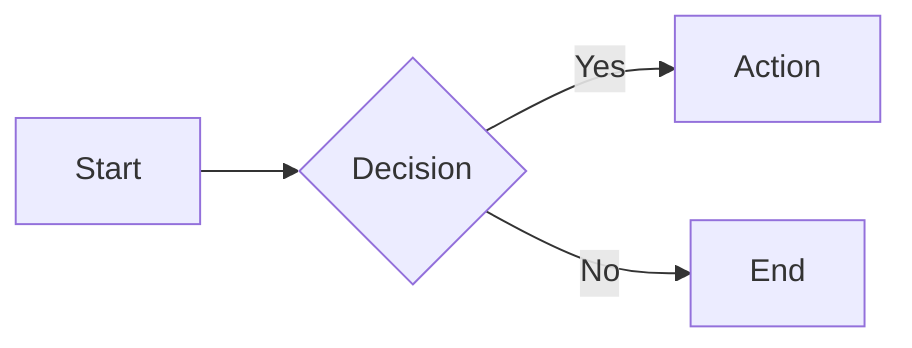
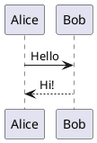

# Slidev

Slidev renders Markdown files as interactive slide presentations. Supports Vue components, UnoCSS styling, Shiki code highlighting, Mermaid diagrams, and LaTeX math.

## Quick Start

```bash
# Create new project
pnpm create slidev

# Or with npm (downloads each time, slower)
npm init slidev@latest

# Dev server
slidev --open

# Export to PDF
slidev export

# Build static SPA
slidev build
```

Entry file defaults to `slides.md`. Pass different file: `slidev other.md`.

## Slide Structure

Slides separated by `---` with blank lines before/after:

```md
---
theme: seriph
title: My Presentation
fonts:
  sans: Inter
  mono: Fira Code
---

# Slide 1: Title Slide

Content here.

---

# Slide 2

More content.

---
layout: center
class: text-center
---

# Centered Slide

This slide uses the `center` layout.
```

### Headmatter (First Slide)

Configures entire deck:

| Field | Purpose | Example |
|-------|---------|---------|
| `theme` | Theme package or name | `seriph`, `default`, `apple-basic` |
| `title` | Presentation title | `My Talk` |
| `fonts` | Google Fonts auto-import | `{ sans: Inter, mono: Fira Code }` |
| `aspectRatio` | Slide ratio | `16/9` (default), `4/3` |
| `canvasWidth` | Canvas width in px | `980` (default) |
| `themeConfig` | Theme-specific config | `{ primary: '#5d8392' }` |
| `transition` | Default slide transition | `slide-left`, `fade` |
| `mdc` | Enable MDC syntax | `true` |

### Per-Slide Frontmatter

```md
---
layout: two-cols
class: my-class
background: /image.png
transition: fade
clicks: 5
---
```

### Speaker Notes

Comments at the END of a slide become presenter notes:

```md
# My Slide

Content visible to audience.

<!-- 
Speaker notes here.
Only visible in presenter view.
Supports **markdown**.
-->
```

## Code Blocks

Shiki syntax highlighting with language tag:

````md
```ts
const greeting = 'Hello, Slidev!'
```
````

### Line Highlighting

```md
```ts {2,3}        // Highlight lines 2-3
```ts {1-3,5}      // Highlight 1-3 and 5
```ts {1|3|5-7}    // Click-stepped: 1, then 3, then 5-7
```ts {*|1|3}{lines:true}  // With line numbers
```

### Options

```md
```ts {lines:true}              // Show line numbers
```ts {startLine:5}             // Start numbering at 5
```ts {maxHeight:'200px'}       // Scrollable with max height
```ts twoslash                  // TwoSlash integration
```

For live code editing, see `references/monaco.md`.

## Styling

### UnoCSS Classes

```md
<div class="text-3xl font-bold text-blue-500 p-4">
  Styled content
</div>
```

### MDC Syntax

Enable with `mdc: true` in headmatter:

```md
# Red Title {.text-red-500}

Paragraph with [styled link]{.text-green-500.underline}.
```

### Scoped Styles

```md
# My Slide

<style>
h1 { color: red; }
</style>
```

### Global Styles

Create `style.css` in project root. Auto-imported.

## Diagrams

### Mermaid

````md

````

### PlantUML

````md

````

## CLI Reference

### Dev Server

```bash
slidev [entry]              # Start dev server (default: slides.md)
slidev --port 8080          # Custom port
slidev --open               # Open browser
slidev --remote             # Enable remote access
slidev --remote mypassword  # Password-protected remote
```

### Build

```bash
slidev build                # Build to ./dist
slidev build --out public   # Custom output dir
slidev build --base /talks/ # Base URL for hosting
```

### Export

```bash
slidev export                       # PDF (default)
slidev export --format png          # PNG per slide
slidev export --format pptx         # PowerPoint (images)
slidev export --format md           # Markdown with PNGs
slidev export --with-clicks         # Separate page per click
slidev export --dark                # Dark mode
slidev export --range 1,3-5         # Specific slides
slidev export --timeout 60000       # Longer timeout
```

Requires `playwright-chromium`: `pnpm add -D playwright-chromium`

## References

| Topic | File |
|-------|------|
| Built-in layouts | `references/layouts.md` |
| Built-in components | `references/components.md` |
| Click animations & transitions | `references/animations.md` |
| Monaco live editor | `references/monaco.md` |
| Themes and addons | `references/themes-addons.md` |
| LaTeX math | `references/latex.md` |

## Resources

- Docs: https://sli.dev
- Theme Gallery: https://sli.dev/resources/theme-gallery
- Addon Gallery: https://sli.dev/resources/addon-gallery
